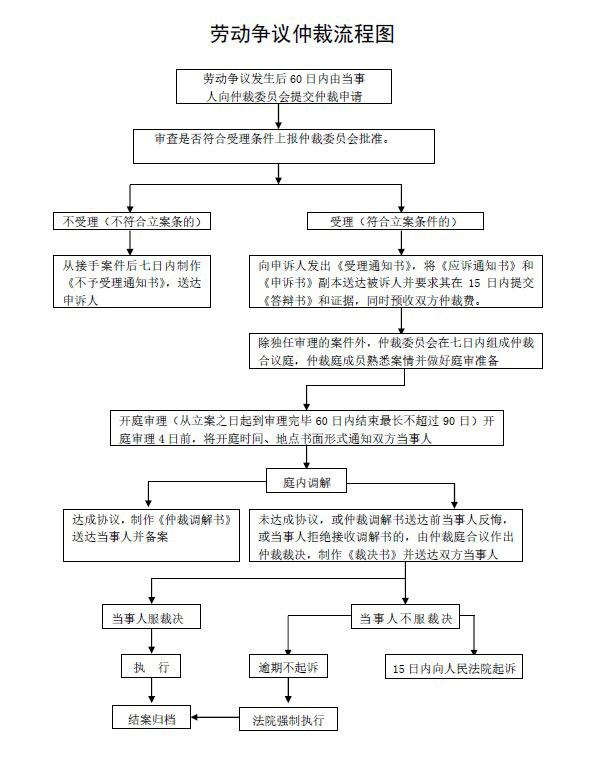

[本项目还在施工过程中，如果你发现点进去是404，代表我还没写，大家都是996的体谅下...本模块预计4月11日前大体可用，4月20日前基本完善。也希望更多有经验的人帮助完善]

# 本板块提供劳动仲裁和劳动诉讼的攻略
本攻略的出现意图很简单————一定要有；劳动仲裁和劳动诉讼时劳动者维护自身权益的最后救济手段，发起之后代表着你将很难继续在原来的公司工作，故不鸣则已，一鸣惊人。本攻略面向所有劳动者，但我不希望任何一个劳动者因此丢失工作，用打扑克做比喻的话，请把它当作王炸。
除此之外，本模块将重点介绍取证这一块，希望大家平时工作中就留意取证。
最后，如果你想在不丢失工作的情况下做一些法律行动，996.action欢迎你。
## [法律分析](Legal-analysis.md)
这一块过于枯燥无味，就写一句，劳动诉讼是仲裁前置的，也就是说发起劳动诉讼必须先进行劳动仲裁，劳动者对仲裁结果不服，可在15日内劳动诉讼；用人单位对仲裁结果不服的，不可以诉讼。对法律感兴趣的同学点蓝字进去看吧。不过劳务派遣的朋友需要看一下[关于劳务派遣的分析](lwpq.md)。
## 是否需要一位律师？证据是否要进行公证？
## 怎么找到当地的劳动仲裁部门？
在公司打开你常用的地图软件，搜索劳动人事争议仲裁委员会，选择离你最近的那家，**劳动争议仲裁不收费**，安心的去吧。

这不是开玩笑，80%的概率你会找对对方，剩下20%的情况，里面的工作人员会告诉你去找谁。当然，你想一次性找对地方，可以打电话问问这个仲裁委员会，或者[劳动争议仲裁的管辖](zcgx.md)

## 收集证据，以备后患
由于劳动者是受用人单位的管理，加班的有关证据一般来说是由用人单位掌握管理，这些证据理应由用人单位提供，如用人单位不愿提供的，应当承担不利后果。但在这之前，劳动者应先举证证明最基础的加班这个事实的存在，否则劳动仲裁院与法院无从判断，反而无法根据事实作出有利于劳动者权益的裁决。

那么应该如何掌握加班这个基础事实证据呢，首先第一步需要劳动者掌握一些基本的取证技巧。
#### 劳动合同和工资记录
最常见的劳动合同和工资记录可以作为证明加班的证据。

劳动合同不仅是劳动关系的一种证明，一般上面还记载着基本工资数额和上下班时间。工资记录，如果用人单位每月发放纸质工资条，一般会显示工资组成情况和工作小时数，不管有无需要员工签收，能拍照录像则尽量拍照录像；如果仅是银行转账流水，也能知道每月的工资发放的时间和数额。

劳动合同上结合工资实际发放数额，能够推算出有无加班。高于正常工资的部分，用人单位需要解释并证明怎么回事；少了结合其他证据也能推算出用人单位是否存在克扣工资的情况。
#### 考勤记录
劳动合同和工资记录并不是唯一的加班证据，除此以外，考勤证据作为有力的加班证据之一，不仅可以证明有无上班加班，而且能够证明加班时长。

如果用人单位还是实行的纸质打卡考勤，那么最简单的方法就是对考勤记录进行拍照或复印。如果是刷卡考勤，那么则需要对考勤电子卡进行拍照存证。同时这里的证据应多天存证。现在的考勤多数已改为人脸或指纹识别考勤，在数据无法调取的情况下，可以对考勤机进行拍照存证。

如有可能，尽可能将考勤卡或考勤电子卡和考勤机一起拍摄，并且连同周围环境（比如装修布置、公司大门或招牌）或者是上下班时一起打卡的情景或人物（公司领导同事甚至是清洁工保安）也一并拍摄。

有一些个别的公司，采取用的是手机定位管理，这就需要劳动者对手机进行拍照截屏，并尽可能对手机打卡软件内容进行详细的内容截取。比如钉钉和微信企业版，劳动者本人可以进行截图，有条件的话也可以拉取后台信息。

也有一些公司根本没有设置机器或手机考勤，仅有手写记录或者是专人记录上班考勤，同样的，能够取得的手写记录需要拍照，并最好能连同当天的报纸或者同事领导或周围一起拍摄。

当然，除了照片以外，如果能够拍摄录像证据，也是万无一失的选择。

对于考勤记录，总结就是一句话，复印或拍照摄像。至此，已经能够证明公司掌握着上班加班的管理证据，劳动者的事实举证任务已经完成。
#### 证人证明
在很多用工不正规的用人单位，别说考勤卡，连劳动合同都没有，工资也是现金签收，又或者是“防备工作”极为严格的用人单位，实物证据取证极为困难，在这种情况下证人证明就能起到证明加班事实的作用。证人一般为公司同事，这里的同事也尽可能应为和公司有劳动关系的人员。

证人证明证据虽有效力，但也存在效力强弱的问题。愿意做证明的同事证人，一般同时也和用人单位存在劳动争议纠纷，或有可能被认为存在利害关系，所以一般也应结合其他证据来使用。
#### 其他证据
这里的其他证据，有可能是工伤的证据，也可有能是出差报销的证据，也有可能是上下班的地铁票，也有可能是经向劳动监察举报后由劳动监察制作的调查证据，这些都能够证明在一段时间内是否有加班的情况。还有一些大家平时上班需要手机以备后患的：领导宣布公开今天加班的录音录像、领导宣布今天加班的电话录音、领导宣布今天加班的微信钉钉截图、领导会议中宣布进行996制度的录音录像等等。
**需要注意的是这些证据并非单一使用即可，仍然需要根据实际情况来判断证据是否完备，有时则需要多种证据同时举证。**
## 仲裁过程

### 申请仲裁需要哪些材料？仲裁申请书怎么写？
#### 哪些是我应得的加班工资？
很多人认为工作时间就是做五休二，但实际上由于存在不同的工时制标准，因而有不同加班时间计算标准。

根据法律规定，工时分为三种，标准工时制、综合计算工时制、不定时工时制。标准工时制，是最广泛应用的标准，也就是我们所谓的做五休二，每天工作八小时、每周工作五天。综合计算工时制，没有所谓的平日和双休日加班、有节假日加班，在一个周期内超过标准工时制的时长即为加班。这类人员比如做一休一的超市销售员。不定时工时制，不受日延长工作时间标准和月延长工作时间标准的限制，但有节假日加班。这类人员比如早期的冷饮厂员工。这三种工时制中，综合计算工时制和不定时工时制适仅用于特定的三类人员，且工时制的实行需要经劳动部门批准。

因此看是否存在加班需要先看劳动者是否符合上述工时制规定，无论劳动合同上对工时制如何约定，不符合的就可按标准计算加班费。

关于标准工时制和综合计算工时制的工作时间，是以21.75天为计薪天数，即（365天-2天*52周）÷12个月=21.75小时。

加班报酬：
1、加点按1.5倍计算，以996和955为例，996加点时间为4小时，需要支付6小时的时薪，也就是3/4日的日薪（强调：法律规定每天最多加班3小时！）
2、公休日按2倍计算，以996和995为例，996公休日加班一天，需要支付16小时的时薪，也就是2日的日薪
3、法定休假日按3倍计算，7个节11天假，这11天加班是需要支付3倍的日薪的。

[劳动仲裁申请书范例](sqs.md)  [下载](sqs.docx)

[劳动仲裁答辩状范例](dbz.md)  [下载](dbz.docx)
### 仲裁过程中，我该干些什么？
### 我要接受调解吗？
### 仲裁结果不满意，我该怎么办？
### 如何对劳动仲裁结果申请强制执行？
[劳动仲裁强制执行申请书范例](qzzx.md)  [下载](qzzx.docx)
## 诉讼过程
### [法律分析](Legal-analysis.md)
过于枯燥同上
### 我的案件该由哪个法院处理？
### 
